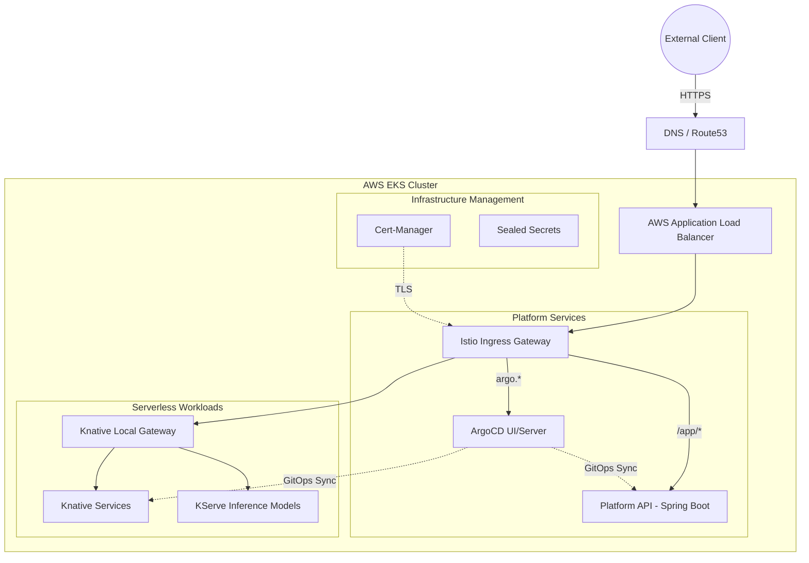
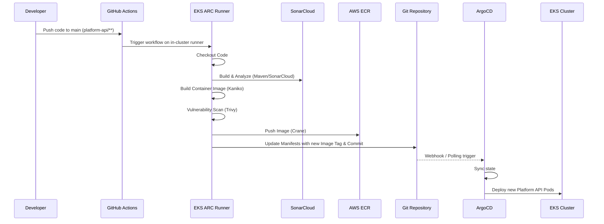
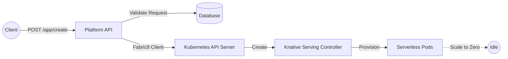

# KubeVision Serverless Platform

A high-performance, event-driven AI inference and application platform built on AWS Elastic Kubernetes Service (EKS). KubeVision leverages Infrastructure as Code (Terraform) and Configuration Management (Ansible) to provision a production-ready cluster. It features serverless auto-scaling (Scale-to-Zero) via Knative and KServe, GitOps-driven delivery with ArgoCD, and automated CI/CD via in-cluster GitHub Action Runners (ARC). The platform is fully monitored and built for end-to-end observability.

---

## Key Features

* **Infrastructure as Code:** Fully automated AWS EKS cluster, VPC, and IAM provisioning using Terraform.
* **GitOps Delivery:** ArgoCD implements the App-of-Apps pattern for declarative, version-controlled cluster state and continuous deployment.
* **Serverless & Scale-to-Zero:** Knative Serving handles request-driven auto-scaling down to zero instances to optimize resource consumption.
* **AI Inference Ready:** Integrated with KServe to deploy and serve machine learning models (e.g., scikit-learn) over standard HTTP/HTTPS interfaces.
* **Advanced Networking & Security:** Utilizes AWS Load Balancer Controller, Istio, and Kubernetes Gateway API for traffic routing, along with Cert-Manager and Sealed Secrets for secure, automated certificate and credential management.
* **In-Cluster CI/CD:** GitHub Actions Runner Controller (ARC) runs ephemeral build agents directly inside the EKS cluster, utilizing Kaniko for daemonless image building and Trivy for security scanning.
* **Platform API:** A custom Java/Spring Boot API leveraging the Fabric8 Kubernetes client to programmatically abstract and manage Knative service deployments.

---

## Architecture Diagrams

### 1. High-Level System Architecture

This diagram illustrates the core components running inside the AWS EKS environment and how external traffic reaches the serverless workloads.



### 2. CI/CD Pipeline Flow (Platform API)

The repository utilizes in-cluster GitHub Action Runners to securely build, scan, and deploy the Platform API.



### 3. Platform API Application Flow

The Platform API allows developers to dynamically deploy containerized applications as serverless Knative services.



---

## Technology Stack

| Category | Technologies |
| --- | --- |
| **Cloud Provider** | AWS (EKS, ECR, VPC, IAM, S3 for TF State) |
| **Infrastructure as Code** | Terraform, Ansible |
| **Container Orchestration** | Kubernetes 1.34 |
| **GitOps & CI/CD** | ArgoCD, GitHub Actions Runner Controller (ARC), Kaniko, Trivy, Crane |
| **Serverless & AI** | Knative Serving, KServe |
| **Networking & Security** | Istio, Kubernetes Gateway API, AWS Load Balancer Controller, Cert-Manager, Sealed Secrets |
| **Platform API** | Java 21, Spring Boot 3, Fabric8 Kubernetes Client, Maven |

---

## Repository Structure

* `Ansible/`: Playbooks and roles to configure cluster tools and bootstrap ArgoCD.
* `Kubernetes/`: Declarative YAML manifests categorized by application (API, GitHub ARC, KServe, Networking, Security, Serverless, Workloads) and ArgoCD Application configurations.
* `platform-api/`: Source code for the Spring Boot application that acts as the control plane for deploying Knative applications.
* `Terraform/`: Modules and configurations to provision the underlying AWS infrastructure.
* `.github/workflows/`: Automation pipelines for infrastructure provisioning, infrastructure destruction, and Platform API CI/CD.

---

## Installation & Setup

### Prerequisites

1. AWS CLI configured with appropriate credentials.
2. Terraform (v1.15.2 or compatible) installed.
3. Ansible installed locally.
4. `kubectl` and `helm` installed.
5. A GitHub Personal Access Token (PAT) with repository permissions.

### Phase 1: Infrastructure Provisioning (Terraform)

1. Navigate to the Terraform directory:
```bash
cd Terraform

```


2. Initialize and apply the configuration:
```bash
terraform init
terraform apply -auto-approve

```


3. Update your local kubeconfig to access the new EKS cluster:
```bash
aws eks update-kubeconfig --region us-east-1 --name KubeVision-prod

```


### Phase 2: Cluster Bootstrap (Ansible)

1. Navigate to the Ansible directory:
```bash
cd ../Ansible

```


2. Install required Ansible dependencies:
```bash
ansible-galaxy collection install kubernetes.core
pip install kubernetes pyyaml

```


3. Run the setup playbook to install ArgoCD and essential CRDs:
```bash
ansible-playbook setup-cluster.yaml

```


### Phase 3: GitOps Deployment (ArgoCD)

1. Navigate to the Kubernetes bootstrap directory:
```bash
cd ../Kubernetes/bootstrap

```


2. Apply the App-of-Apps manifest to trigger the automated deployment of all cluster resources:
```bash
kubectl apply -f app-of-apps.yaml

```


3. Retrieve the ArgoCD initial admin password:
```bash
kubectl -n argocd get secret argocd-initial-admin-secret -o jsonpath="{.data.password}" | base64 -d

```


### Phase 4: CI/CD Secrets Configuration

To allow the in-cluster runners to push code and analyze data, ensure the following secrets are set in your GitHub repository settings:

* `SONAR_TOKEN`: For SonarCloud analysis.
* Ensure OIDC integration is configured for AWS to allow GitHub Actions to assume the `terraform` IAM role.

---

## Platform API Usage Guide

The Platform API allows you to create auto-scaling serverless applications on demand. It is exposed via the Istio Ingress Gateway at `creative.opik.net`.

### Create a Serverless Application

Send a `POST` request to the `/app/create` endpoint to deploy a new container image as a Knative Service.

**Request:**

```bash
curl -X POST [https://creative.opik.net/app/create](https://creative.opik.net/app/create) \
  -H "Content-Type: application/json" \
  -d '{
    "appName": "my-custom-app",
    "namespace": "default",
    "imageRef": "nginx:latest",
    "containerPort": 80
  }'

```

**Response:**

```json
{
  "message": "Application deployed successfully",
  "url": "[https://my-custom-app.creative.opik.net](https://my-custom-app.creative.opik.net)"
}

```

### Delete an Application

Send a `DELETE` request to remove a previously deployed application.

**Request:**

```bash
curl -X DELETE [https://creative.opik.net/app/](https://creative.opik.net/app/) \
  -H "Content-Type: application/json" \
  -d '{
    "appName": "my-custom-app",
    "namespace": "default"
  }'

```

---

## Infrastructure Teardown

To destroy the infrastructure and avoid incurring AWS charges, you can use the provided GitHub Actions workflow `Infrastructure Destroy` or run Terraform locally:

```bash
cd Terraform
terraform destroy -auto-approve

```
